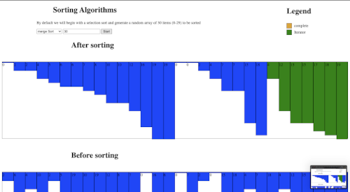

# sorting_algorithms_visualized

This is a public repository still in production so bear with me XD

# To run this project
I would suggest creating a python [virtual environment](https://docs.python.org/3/library/venv.html#creating-virtual-environments) before running the following steps

## Step 1: Clone the Repo
>git clone https://github.com/Frankothe196/sorting_algorithms_visualized.git

## Step 2: Run install dependencies
>pip install -r requirements.txt

## Step 3: Set flask environment variable
>export FLASK_APP=main.py

## Step 4: Run the app
>flask run
